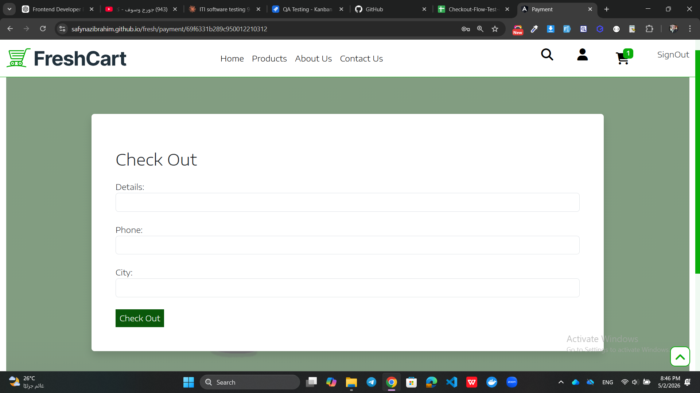
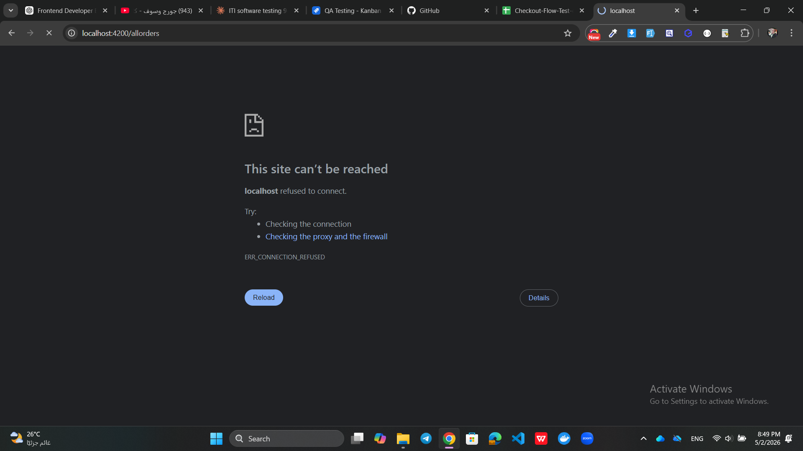
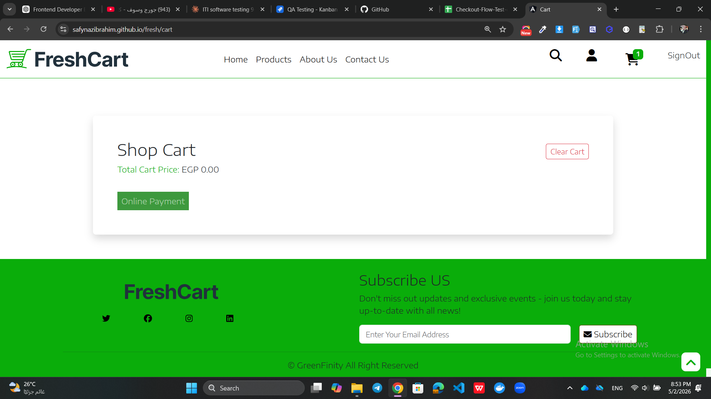

# Checkout Flow Screenshots - Bug Evidence

This file contains visual evidence of bugs found during testing of the Checkout Flow functionality in the FreshCart application.

---

## 🐞 Bug 1 — Checkout Form Has No Validation

### Description
Checkout form accepts any input including empty fields with no validation errors.

All of the following cases submitted successfully without any error:
- All fields empty ❌
- Details field empty ❌
- Phone field empty ❌
- City field empty ❌
- Invalid phone format (e.g., 123) ❌
- Letters in phone field (e.g., abcde) ❌

No required field indicators exist on the form.
No validation messages appear on any field.
Form submits directly to Stripe regardless of input.

### Affected Test Cases
TC-Check-2, TC-Check-3, TC-Check-4, TC-Check-5, TC-Check-6, TC-Check-7

### JIRA Ticket
🔗 [KAN-22 - Checkout Form Has No Validation](https://safynazibrahim4.atlassian.net/browse/KAN-22)

---

## 🐞 Bug 2 — After Payment User Redirected to Localhost Instead of Live URL

### Description
After completing payment successfully on Stripe, the user is redirected to localhost:4200/allorders instead of the live application URL.

Expected redirect:
safynazibrahim.github.io/fresh/allorders

Actual redirect:
localhost:4200/allorders → "This site can't be reached" error

Root Cause:
Stripe success URL is configured to localhost
Should be updated to live production URL

### Affected Test Cases
TC-Check-11, TC-Check-12

### JIRA Ticket
🔗 [KAN-23 - Wrong Redirect After Payment](https://safynazibrahim4.atlassian.net/browse/KAN-23)

---

## 🐞 Bug 3 — Cart Badge Not Updated and Empty Cart Message Not Displayed After Payment

### Description
Two issues occur after successful payment:

**Issue 1 — After payment (going back to cart):**
- Cart items removed correctly ✅
- Cart badge in navbar still shows old quantity ❌
- Empty cart message not displayed — page shows blank ❌

**Issue 2 — After logout and login with same account:**
- Cart badge shows 0 ✅
- Cart page shows blank — empty cart message not displayed ❌

Both issues are related to the same empty cart message bug found in user flow testing.

### Related Bug
🔗 KAN-20 — No empty cart message after Remove button

### Affected Test Cases
TC-Check-16, TC-Check-17

### JIRA Ticket
🔗 [KAN-24 - Cart Badge and Empty Message Issues After Payment](https://safynazibrahim4.atlassian.net/browse/KAN-24)

---
