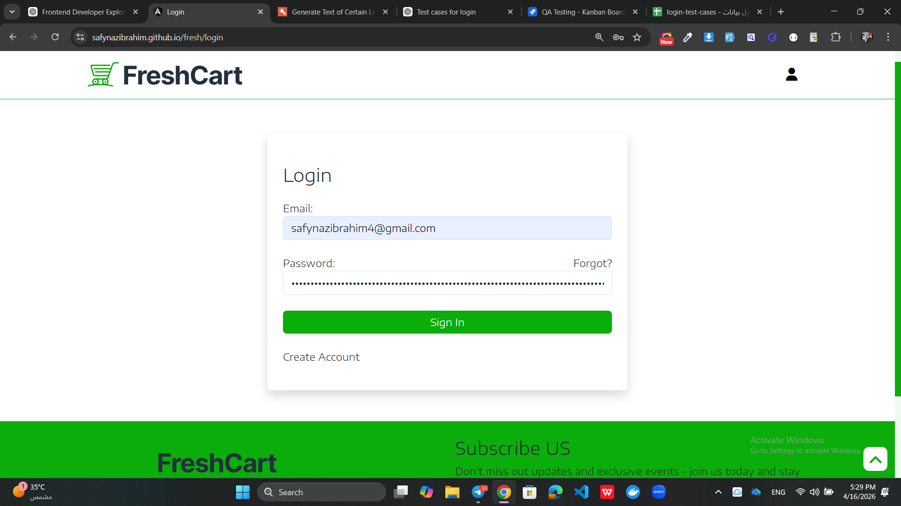
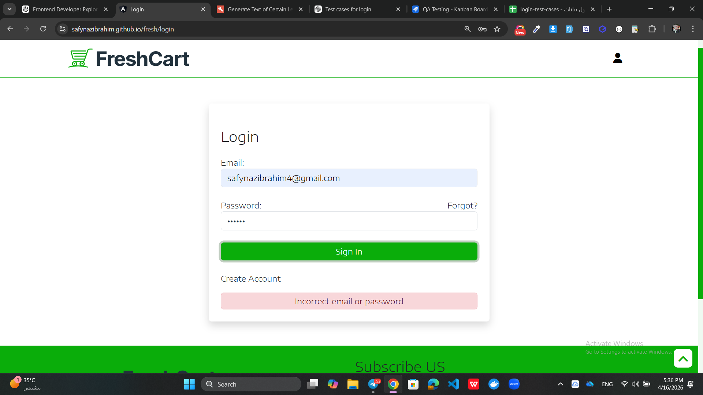

# Login Screenshots - Bug Evidence

This file contains visual evidence of login-related bugs found during testing of the FreshCart application.

---

## 🐞 Bug 1 - Password Max Length Issue

### Description
The password field allows input beyond the expected maximum length. The system does not properly restrict or validate long password inputs, which leads to unexpected behavior during login.

### Jira Ticket
🔗 [KAN-5 - Password Max Length Issue](https://safynazibrahim4.atlassian.net/browse/KAN-5)

---

## 🐞 Bug 2 - Persistent Error Message Issue

### Description
After a failed login attempt, the error message remains visible even after entering correct credentials and retrying login. The message only disappears after successful navigation to the home page.

### Jira Ticket
🔗 [KAN-6 - Error Message Persistence](https://safynazibrahim4.atlassian.net/browse/KAN-6)
