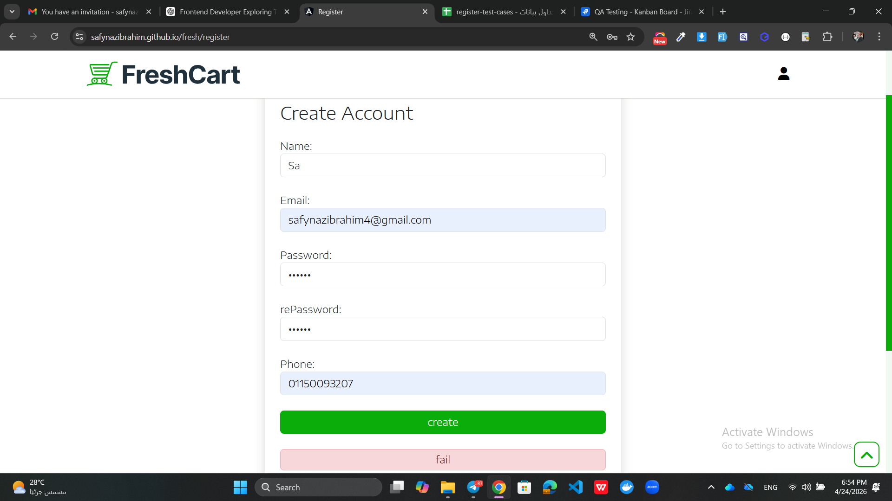
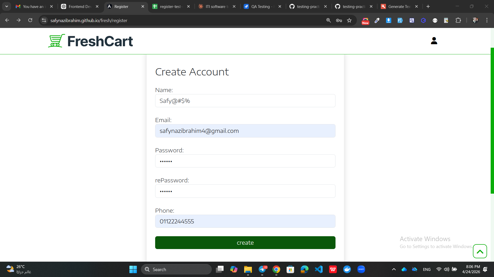
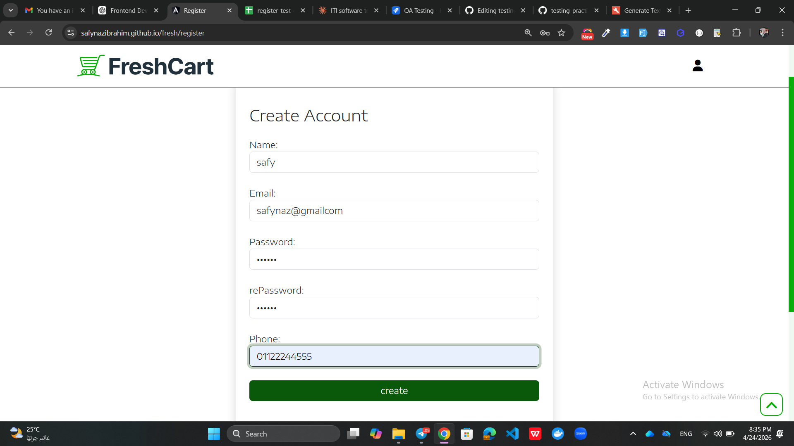
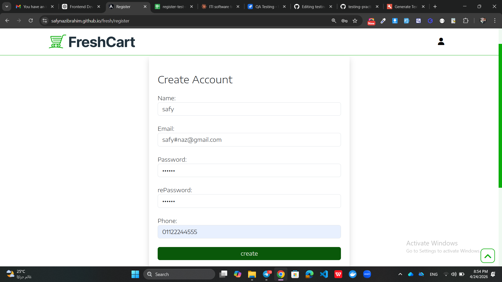

# Register Screenshots - Bug Evidence

This file contains visual evidence of bugs found during testing of the Register functionality in the FreshCart application.

---

## 🐞 Bug 1 - Validation Error Message Not Displayed Correctly

### Description
When the user enters invalid data (e.g., name less than 3 characters) and clicks the Register button, the system does not display the correct validation message.

Instead of showing the specific error returned from the backend (e.g., "Name must be at least 3 characters"), the UI displays a generic message "fail".

This prevents the user from understanding the exact issue and how to fix it.

### Jira Ticket
🔗 [KAN-7 - Validation Error Message Issue](https://safynazibrahim4.atlassian.net/browse/KAN-7)

---
## 🐞 Bug 2 — Name Field Has No Maximum Character Limit

### Description
When the user enters a name with 100 characters and clicks Register, the system does not display any validation error.

Instead of showing an error message like "Name must not exceed character limit", the system registers the user successfully — meaning there is no maximum length validation on the name field.

### JIRA Ticket
🔗 [KAN-8 - Name Field Has No Maximum Character Limit](https://safynazibrahim4.atlassian.net/browse/KAN-8)

---

## 🐞 Bug 3 — Name Field Accepts Numbers Without Validation

### Description
When the user enters a name containing numbers (e.g., Safynaz123) and clicks Register, the system does not display any validation error.
Instead of showing an error message like "Name must contain letters only", the system registers the user successfully — meaning there is no letters-only validation on the name field.

### JIRA Ticket
🔗 [KAN-9 - Name Field Accepts Numbers Without Validation](https://safynazibrahim4.atlassian.net/browse/KAN-9)

---
## 🐞 Bug 4 — Name Field Accepts Special Characters Without Validation

### Description
When the user enters a name containing special characters (e.g., Safy@#$%) and clicks Register, the system does not display any validation error.
Instead of showing an error message like "Name must contain letters only", the system registers the user successfully — meaning there is no special character restriction on the name field.

### JIRA Ticket
🔗 [KAN-10 - Name Field Accepts Special Characters Without Validation](https://safynazibrahim4.atlassian.net/browse/KAN-10)

---
## 🐞 Bug 5 — Email Field Has No Frontend Validation And Displays Wrong Error Message

### Description
When the user enters an email without a dot in the domain (e.g., safynaz@gmailcom) and clicks Register, two problems occur:

**Problem 1 — No Frontend Validation:**
Email format is not validated on the field level before submitting.
Invalid email triggers an unnecessary server request — wasting resources.
Error should appear on the field itself before any server call.

**Problem 2 — Wrong Error Message:**
Server correctly returns "invalid email" error.
But frontend displays generic "Fail" message instead of real error.
User cannot understand what is wrong with their input.

### JIRA Ticket
🔗 [KAN-11 - Email Field Has No Frontend Validation And Displays Wrong Error Message](https://safynazibrahim4.atlassian.net/browse/KAN-11)
---

## 🐞 Bug 6 — Email Field Accepts Special Characters Without Validation

### Description
When the user enters an email containing invalid special characters (e.g., safy#naz@gmail.com) and clicks Register, the system does not display any validation error.
Instead of showing "Invalid email format", the system registers the user successfully.
Invalid email addresses are being saved in the system — meaning the user may register with an email they can never actually use.

### Test Case
TC-Reg-15 — Email with special characters

### Related Bug
🔗 Similar frontend validation issue as KAN-11

### JIRA Ticket
🔗 [KAN-12 - Email Field Accepts Special Characters Without Validation](paste KAN-12 link here after creating in JIRA)

---
