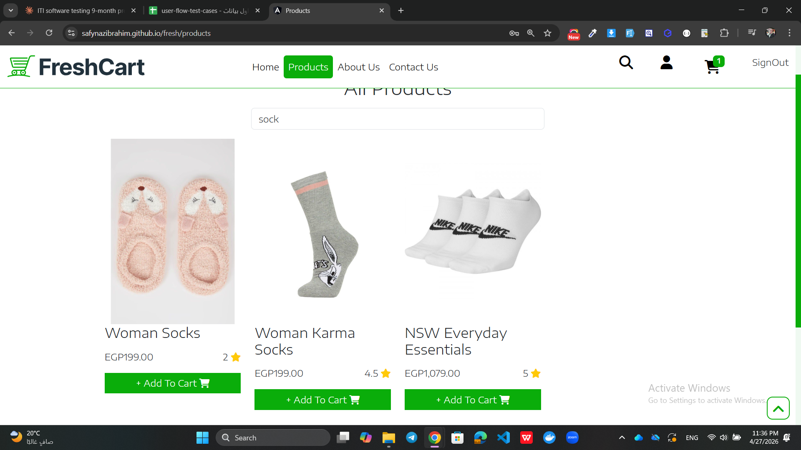
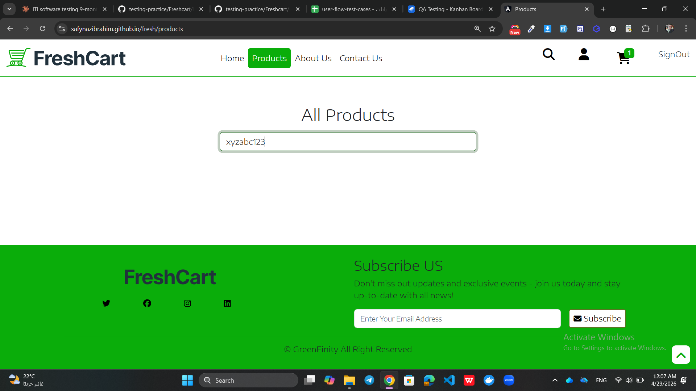

# User Flow Screenshots - Bug Evidence

This file contains visual evidence of bugs found during testing of the User Flow functionality in the FreshCart application.

---

## 🐞 Bug 1 — Search Returns Irrelevant Products Not Matching Keyword

### Description
When the user searches for "sock", the system returns irrelevant results.

Expected products to appear:
- Woman Socks ✅
- Woman Karma Socks ✅

Product that should NOT appear:
- NSW Everyday Essentials ❌ — name does not contain "sock"

Search is likely matching by category instead of product name only.
This gives the user irrelevant results and affects search accuracy.

### JIRA Ticket
🔗 [https://safynazibrahim4.atlassian.net/browse/KAN-16]

---

## 🐞 Bug 2 — No Message Displayed When Search Returns Empty Results

### Description
When the user searches for a keyword that matches no products (e.g., xyzabc123), the page shows completely empty with no message or feedback.

Instead of showing a helpful message like "No products found", the page just goes blank — leaving the user confused about what happened.

### Test Case
TC-Flow-7 — Search with no results

### JIRA Ticket
🔗 [https://safynazibrahim4.atlassian.net/browse/KAN-19]

---

## 🐞 Bug 3 — No Empty Cart Message After Removing Last Product

### Description
When the user removes the last product from cart using the Remove button, the page shows completely blank with no empty cart message.

Inconsistent behavior:
- Remove button → blank page after last item removed ❌
- Clear Cart button → empty cart message displayed correctly ✅

User cannot tell if cart is empty or something went wrong.

### Test Case
TC-Flow-27 — Remove last item — cart empty

### JIRA Ticket
🔗 [KAN-20 - No Empty Cart Message After Remove](https://safynazibrahim4.atlassian.net/browse/KAN-20)

---

